# Лабораторная работа №4.
## Основные типы и операции в Python.

Чтобы запустить каждую из программ в терминале следует написать `python .\name.py` 

### Задание 00.

```python
#!/usr/bin/env python3
# -*- coding: utf-8 -*-

# Есть словарь координат городов

sites = {
    'Moscow': (550, 370),
    'London': (510, 510),
    'Paris': (480, 480),
}

# Составим словарь словарей расстояний между ними
# расстояние на координатной сетке - ((x1 - x2) ** 2 + (y1 - y2) ** 2) ** 0.5

distances = {}

# TODO здесь заполнение словаря
for city1 in sites: 
    distances[city1] = {} 
    for city2 in sites: 
        if city1 != city2: 
            x1, y1 = sites[city1] 
            x2, y2 = sites[city2] 
            distance = ((x1 - x2) ** 2 + (y1 - y2) ** 2) ** 0.5 
            distances[city1][city2] = distance 

for key,value in distances.items():
    print(key,value)
```

### Результат программы.
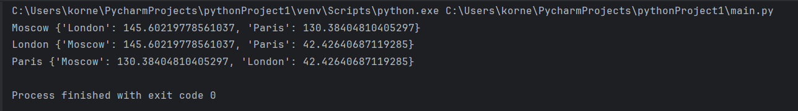

### Задание 01.
```python
#!/usr/bin/env python3
# -*- coding: utf-8 -*-

# Есть значение радиуса круга
radius = 42

# Выведите на консоль значение прощади этого круга с точностю до 4-х знаков после запятой

# TODO здесь ваш код

r = radius
pi = 3.1415926

circle = (pi * (r ** 2))

circle = round(circle, 4)
print(circle)

# Далее, пусть есть координаты точки
point_1 = "(23, 34)"
# где 23 - координата х, 34 - координата у

# Если точка point лежит внутри того самого круга [центр в начале координат (0, 0), radius = 42],
# то выведите на консоль True, Или False, если точка лежит вовне круга.

# TODO здесь ваш код
x1, y1 = point_1.strip('()').split(',')
print(int(x1)**2 + int(y1)**2 <= r**2)
# Аналогично для другой точки
point_2 = "(30, 30)"
# Если точка point_2 лежит внутри круга (radius = 42), то выведите на консоль True, Или False, если точка лежит вовне круга.
# TODO здесь ваш код
x2, y2 = point_2.strip('()').split(',')
print(int(x2)**2 + int(y2)**2 <= r**2)
```

### Результат программы.
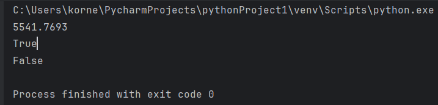

### Задание 02.
```python
#!/usr/bin/env python3
# -*- coding: utf-8 -*-

# Расставьте знаки операций "плюс", "минус", "умножение" и скобки
# между числами "1 2 3 4 5" так, что бы получилось число "25".
#
# Использовать нужно только указанные знаки операций, но не обязательно все перечесленные.
# Порядок чисел нужно сохранить.

# Пример для чисел "1 2 3" и "9"
result = (1 + 2) * 3
print(result)

# TODO написать формулу для 1 2 3 4 5 и вывести значение на консоль
res = -1 + (2*3) + (4*5)
print('res = ', res)
```
### Результат программы.
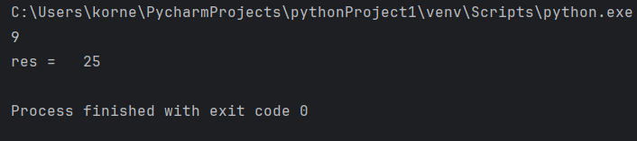

### Задание 03.
```python
#!/usr/bin/env python3
# -*- coding: utf-8 -*-

# Есть строка с перечислением фильмов

my_favorite_movies = 'Терминатор, Пятый элемент, Аватар, Чужие, Назад в будущее'

# Выведите на консоль с помощью индексации строки, последовательно:
#   первый фильм
#   последний
#   второй
#   второй с конца

# Запятая не должна выводиться.  Переопределять my_favorite_movies нельзя
# Использовать .split() или .find()или другие методы строки нельзя - пользуйтесь только срезами,
# как указано в задании!

# TODO здесь ваш код
num1 =  my_favorite_movies [0:10]
end = my_favorite_movies [42:57]
num2 = my_favorite_movies [12:25]
num4 = my_favorite_movies [35:40]
print(num1, end, num2, num4)
```
### Результат программы.
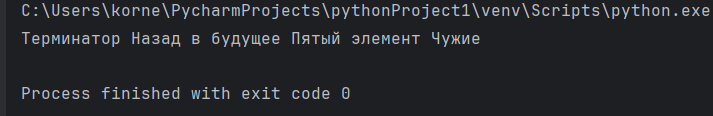

### Задание 04.
```python
#!/usr/bin/env python3
# -*- coding: utf-8 -*-

# Создайте списки:

# моя семья (минимум 3 элемента, есть еще дедушки и бабушки, если что)
my_family = ['I_am','My_mam','My_dad','My_brother']

# список списков приблизителного роста членов вашей семьи
my_family_height = [['I', 168 ], ['mam', 164], ['dad', 176], ['brother', 150]
    # ['имя', рост],
]

# Выведите на консоль рост отца в формате
#   Рост отца - ХХ см

# Выведите на консоль общий рост вашей семьи как сумму ростов всех членов
#   Общий рост моей семьи - ХХ см
summa = my_family_height[0][1] + my_family_height[1][1] + my_family_height[2][1] + my_family_height[3][1]
print('Рост отца: ',  my_family_height[2][1], ' см' )
print('Суммарный рост моей семьи = ', summa, ' см' )
```
### Результат программы.
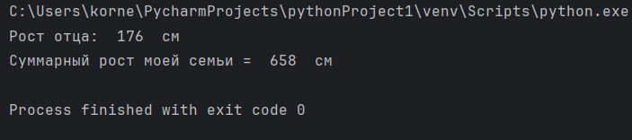

### Задание 05.
```python
#!/usr/bin/env python3
# -*- coding: utf-8 -*-

# есть список животных в зоопарке

zoo = ['lion', 'kangaroo', 'elephant', 'monkey', ]

# посадите медведя (bear) между львом и кенгуру
#  и выведите список на консоль
# TODO здесь ваш код
zoo.insert(1, 'bear')  
print(zoo)
# добавьте птиц из списка birds в последние клетки зоопарка
birds = ['rooster', 'ostrich', 'lark', ]
#  и выведите список на консоль
# TODO здесь ваш код
zoo.extend(birds)
print(zoo)
# уберите слона
#  и выведите список на консоль
# TODO здесь ваш код
zoo = zoo[0:3]+zoo[4:]
print(zoo)
# выведите на консоль в какой клетке сидит лев (lion) и жаворонок (lark).
# Номера при выводе должны быть понятны простому человеку, не программисту.
# TODO здесь ваш код
print('lion in №', (zoo.index('lion') + 1))
print('lark in №', (zoo.index('lark') + 1))

```
### Результат программы.
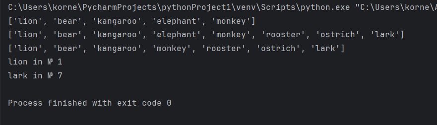

### Задание 06.
```python
#!/usr/bin/env python3
# -*- coding: utf-8 -*-

# Есть список песен группы Depeche Mode со временем звучания с точностью до долей минут
# Точность указывается в функции round(a, b)
# где a, это число которое надо округлить, а b количество знаков после запятой

violator_songs_list = [
    ['World in My Eyes', 4.86],
    ['Sweetest Perfection', 4.43],
    ['Personal Jesus', 4.56],
    ['Halo', 4.9],
    ['Waiting for the Night', 6.07],
    ['Enjoy the Silence', 4.20],
    ['Policy of Truth', 4.76],
    ['Blue Dress', 4.29],
    ['Clean', 5.83],
]

# распечатайте общее время звучания трех песен: 'Halo', 'Enjoy the Silence' и 'Clean' в формате
#   Три песни звучат ХХХ.XX минут
# Обратите внимание, что делать много вычислений внутри print() - плохой стиль.
# Лучше заранее вычислить необходимое, а затем в print(xxx, yyy, zzz)

# TODO здесь ваш код
a = violator_songs_list [3][1]
b = violator_songs_list [5][1]
c = violator_songs_list [8][1]
summa_song = a+b+c
s1 = '{0:.2f}'.format(summa_song)
print(" The three songs are playing = ", s1)
# Есть словарь песен группы Depeche Mode
violator_songs_dict = {
    'World in My Eyes': 4.76,
    'Sweetest Perfection': 4.43,
    'Personal Jesus': 4.56,
    'Halo': 4.30,
    'Waiting for the Night': 6.07,
    'Enjoy the Silence': 4.6,
    'Policy of Truth': 4.88,
    'Blue Dress': 4.18,
    'Clean': 5.68,
}

# распечатайте общее время звучания трех песен: 'Sweetest Perfection', 'Policy of Truth' и 'Blue Dress'
#   А другие три песни звучат ХХХ минут

# TODO здесь ваш код
A = violator_songs_dict['Sweetest Perfection']
B = violator_songs_dict['Policy of Truth']
C = violator_songs_dict['Blue Dress']
Summa2 = A+B+C
s2 = '{0:.2f}'.format(Summa2)
print(' The other three songs are playing', s2 , ' minutes')
```
### Результат программы.
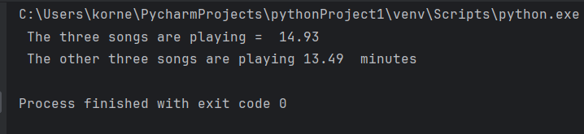

### Задание 07.
```python
#!/usr/bin/env python3
# -*- coding: utf-8 -*-

# Есть зашифрованное сообщение

secret_message = [
    'квевтфпп6щ3стмзалтнмаршгб5длгуча',
    'дьсеы6лц2бане4т64ь4б3ущея6втщл6б',
    'т3пплвце1н3и2кд4лы12чф1ап3бкычаь',
    'ьд5фму3ежородт9г686буиимыкучшсал',
    'бсц59мегщ2лятьаьгенедыв9фк9ехб1а',
]

# Нужно его расшифровать и вывести на консоль в удобочитаемом виде.
# Должна получиться фраза на русском языке, например: как два байта переслать.

# Ключ к расшифровке:
#   первое слово - 4-я буква
#   второе слово - буквы с 10 по 13, включительно
#   третье слово - буквы с 6 по 15, включительно, через одну
#   четвертое слово - буквы с 8 по 13, включительно, в обратном порядке
#   пятое слово - буквы с 17 по 21, включительно, в обратном порядке
#
# Обратите вниманме:
#   даны номера букв, а не индексы
#   срез не включает последний индекс
#   подробную информацию об обратных срезах см https://clck.ru/MfEMS

# TODO вывести расшифрованное сообщение
a = secret_message[0][3]
b = secret_message[1][9:13]
c = secret_message[2][5:15:2]
d = secret_message[3][12:6:-1]
e = secret_message[4][20:15:-1]
print(a, b, c, d, e)
```
### Результат программы.
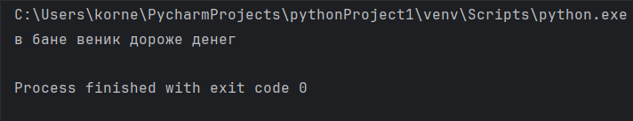

### Задание 08.
```python
#!/usr/bin/env python3
# -*- coding: utf-8 -*-

# в саду сорвали цветы
garden = ('ромашка', 'роза', 'одуванчик', 'ромашка', 'гладиолус', 'подсолнух', 'роза', )

# на лугу сорвали цветы
meadow = ('клевер', 'одуванчик', 'ромашка', 'клевер', 'мак', 'одуванчик', 'ромашка', )

# создайте множество цветов, произрастающих в саду и на лугу
# garden_set =
# meadow_set =
# TODO здесь ваш код
garden_set = set(garden)
meadow_set = set(meadow)
sett = garden_set | meadow_set

# выведите на консоль все виды цветов
# TODO здесь ваш код
print(sett)
# выведите на консоль те, которые растут и там и там
# TODO здесь ваш код
mett = garden_set & meadow_set
print(mett)
# выведите на консоль те, которые растут в саду, но не растут на лугу
# TODO здесь ваш код
dett = garden_set - meadow_set
print(dett)
# выведите на консоль те, которые растут на лугу, но не растут в саду
# TODO здесь ваш код
qett = meadow_set - garden_set
print(qett)
```
### Результат программы.
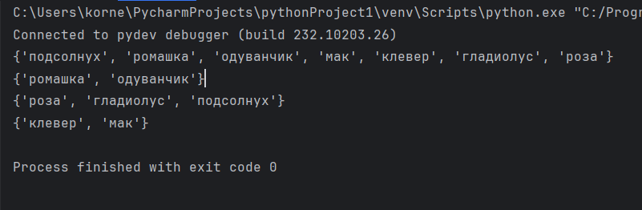

### Задание 09.
```python
#!/usr/bin/env python3
# -*- coding: utf-8 -*-

# Есть словарь магазинов с распродажами

shops = {
    'ашан':
        [
            {'name': 'печенье', 'price': 10.99},
            {'name': 'конфеты', 'price': 34.99},
            {'name': 'карамель', 'price': 45.99},
            {'name': 'пирожное', 'price': 67.99}
        ],
    'пятерочка':
        [
            {'name': 'печенье', 'price': 9.99},
            {'name': 'конфеты', 'price': 32.99},
            {'name': 'карамель', 'price': 46.99},
            {'name': 'пирожное', 'price': 59.99}
        ],
    'магнит':
        [
            {'name': 'печенье', 'price': 11.99},
            {'name': 'конфеты', 'price': 30.99},
            {'name': 'карамель', 'price': 41.99},
            {'name': 'пирожное', 'price': 62.99}
        ],
}

# Создайте словарь цен на продкты следующего вида (писать прямо в коде)
sweets = {
    'печенье': [
        {'shop': 'ашан', 'price': 10.99},
        {'shop': 'пятерочка', 'price': 9.99},
    ],
    'карамель': [
        {'shop': 'ашан', 'price': 45.99},
        {'shop': 'магнит', 'price': 41.99},
    ],
}
# Указать надо только по 2 магазина с минимальными ценами
print("Печенье в магазине", sweets['печенье'][0]['shop'], "стоят", sweets['печенье'][0]['price'], "руб.")
print("Печенье в магазине", sweets['печенье'][1]['shop'], "стоят", sweets['печенье'][1]['price'], "руб.")
print("Карамель в магазине", sweets['карамель'][0]['shop'], "стоят", sweets['карамель'][0]['price'], "руб.")
print("Карамель в магазине", sweets['карамель'][1]['shop'], "стоят", sweets['карамель'][1]['price'], "руб.")
```
### Результат программы.
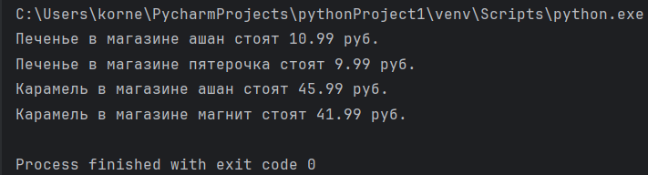

### Задание 10.
```python
#!/usr/bin/env python3
# -*- coding: utf-8 -*-

# Есть словарь кодов товаров

goods = {
    'Лампа': '12345',
    'Стол': '23456',
    'Диван': '34567',
    'Стул': '45678',
}

# Есть словарь списков количества товаров на складе.

store = {
    '12345': [
        {'quantity': 27, 'price': 42},
    ],
    '23456': [
        {'quantity': 22, 'price': 510},
        {'quantity': 32, 'price': 520},
    ],
    '34567': [
        {'quantity': 2, 'price': 1200},
        {'quantity': 1, 'price': 1150},
    ],
    '45678': [
        {'quantity': 50, 'price': 100},
        {'quantity': 12, 'price': 95},
        {'quantity': 43, 'price': 97},
    ],
}

# Рассчитать на какую сумму лежит каждого товара на складе
# например для ламп

lamps_cost = store[goods['Лампа']][0]['quantity'] * store[goods['Лампа']][0]['price']
# или проще (/сложнее ?)
lamp_code = goods['Лампа']
lamps_item = store[lamp_code][0]
lamps_quantity = lamps_item['quantity']
lamps_price = lamps_item['price']
lamps_cost = lamps_quantity * lamps_price
print('Лампа -', lamps_quantity, 'шт, стоимость', lamps_cost, 'руб')

# Вывести стоимость каждого вида товара на складе:
# один раз распечать сколько всего столов и их общая стоимость,
# один раз распечать сколько всего стульев и их общая стоимость,
#   и т.д. на складе
# Формат строки <товар> - <кол-во> шт, стоимость <общая стоимость> руб

# WARNING для знающих циклы: БЕЗ циклов. Да, с переменными; да, неэффективно; да, копипаста.
# Это задание на ручное вычисление - что бы потом понять как работают циклы и насколько с ними проще жить.

# TODO здесь ваш код
table_cost = store[goods['Стол']][0]['quantity'] * store[goods['Стол']][0]['price']

table_cost2 = store[goods['Стол']][1]['quantity'] * store[goods['Стол']][1]['price']

sofa_code = goods['Диван']
sofa_item = store[sofa_code][0]
sofa_quantity = sofa_item['quantity']
sofa_price = sofa_item['price']
sofa_cost = sofa_quantity * sofa_price

sofa_cost2 = store[goods['Диван']][1]['quantity'] * store[goods["Диван"]][1]['price']

chair_code = goods['Стул']
chair_item = store[chair_code][0]
chair_quantity = chair_item['quantity']
chair_price = chair_item['price']
chair_cost = chair_quantity * chair_price

chair_item2 = store[chair_code][1]
chair_quantity2 = chair_item2['quantity']
chair_price2 = chair_item2['price']
chair_cost2 = chair_quantity2 * chair_price2

chair_cost3 = store[goods['Стул']][2]["quantity"] * store[goods['Стул']][2]["price"]

print("Стол 1 типа -", store[goods['Стол']][0]['quantity'], "шт., общая стоимость", table_cost, "руб.")
print("Стол 2 типа -", store[goods['Стол']][1]['quantity'], "шт., общая стоимость", table_cost2, "руб.")
print("Диван 1 тип -", sofa_quantity, "шт., общая стоимость", sofa_cost, 'руб.')
print("Диван 2 тип -", store[goods["Диван"]][1]["quantity"], "шт, общая стоимость", sofa_cost2, "руб.")
print("Стул 1 тип -", chair_quantity, "шт., общая стоимость", chair_cost, "руб.")
print("Стул 2 тип -", chair_quantity2, "шт., общая стоимость", chair_cost2, "руб.")
print("Стул 3 тип -", store[goods["Стул"]][2]["quantity"], "шт., общая стоимость", chair_cost3, "руб.")
```
### Результат программы.
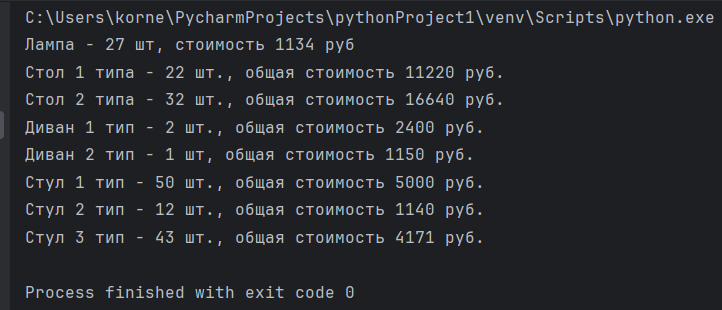
